# PITWALL — The Silent Co-Driver

**Grand Prix hackathon · Problem Statement 1 · Powered by Hugging Face**

A race engineer's co-pilot. It reads a driver's state from their radio calls, measures what that
state is costing in lap time, and tells the engineer whether to press the talk button at all —
and in how many words.

Runs on **real Formula 1 team radio** paired with **real lap timing**. Every model runs locally
on CPU; no audio leaves the machine.

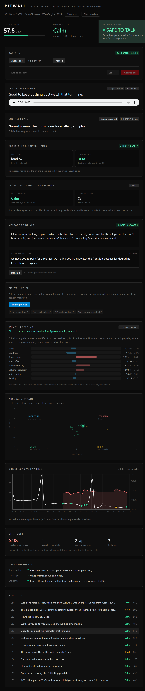

---

## The 60-second version

| | |
|---|---|
| **Input** | A radio clip (upload, record, or a real OpenF1 broadcast transmission) |
| **Measures** | 8 explainable voice biomarkers — no black box |
| **Compares** | Against *that driver's own* baseline, not a population average |
| **Outputs** | Driver load 0–100, one of four states, and a **radio window** with a word budget |
| **Rewrites** | The engineer's message to fit the budget |
| **Cross-checks** | Against car telemetry and an off-the-shelf emotion classifier |
| **Refuses** | When the audio, or the calibration, cannot support a conclusion |

The useful output is not a mood label. It is a decision: **talk, or don't.**

---

## What you can do with it

### 1. Read the driver, and get a call you can act on

Select any radio transmission. The strip gives load, state and the radio window; below it sits the
recommended action and the exact transcript it came from.

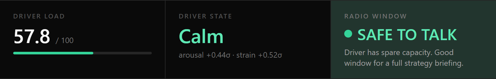

Here Piastri reads **Calm, load 57.8** — so the window is **SAFE TO TALK**: *"Driver has spare
capacity. Good window for a full strategy briefing."*

### 2. See exactly why — every number is auditable

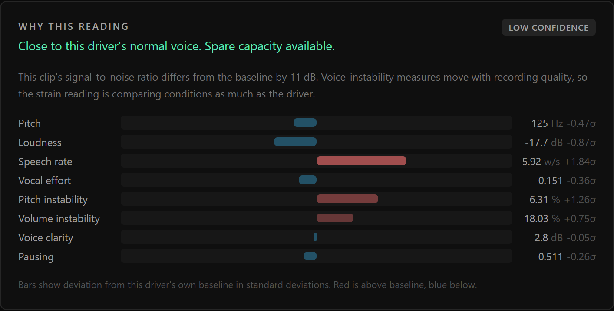

Eight measurements, each shown as deviation from this driver's own baseline in standard deviations.
Red is above baseline, blue below. Nothing is taken on trust, and the confidence line states what
would make the reading unreliable.

### 3. Watch the call change when the driver does

The same stint, a different transmission — **Tired, load 66.2, strain +2.17σ**:

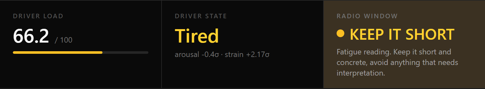

The window closes to **KEEP IT SHORT**, and the advice changes with it:

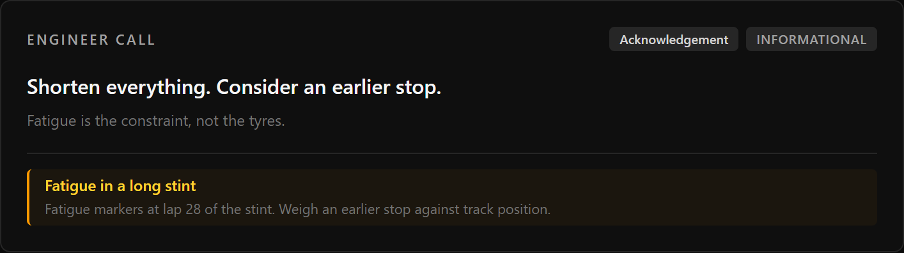

### 4. Have your message rewritten to fit the window

The engineer types what they want to say. PITWALL cuts it to the budget — filler first, then
justifications, keeping imperatives and numbers.

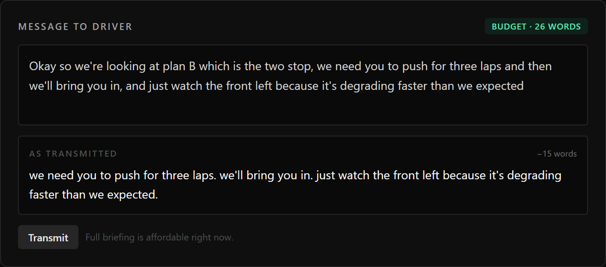

At a 26-word budget the briefing goes out nearly whole. On the *Tired* call above the budget drops
to 12 words, and the same message is cut to the instruction alone:

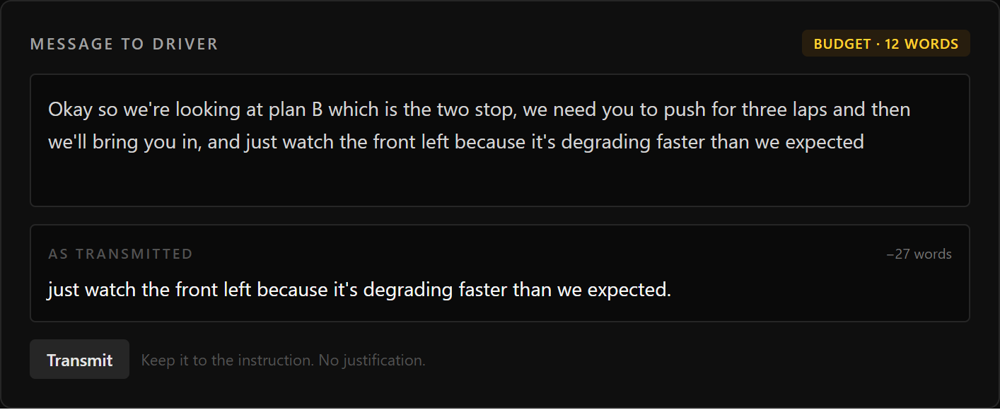

### 5. Cross-check the voice against the car

The driver's throttle and brake inputs are an independent channel — the driver never talks about
them. When both agree, the confidence is genuine:

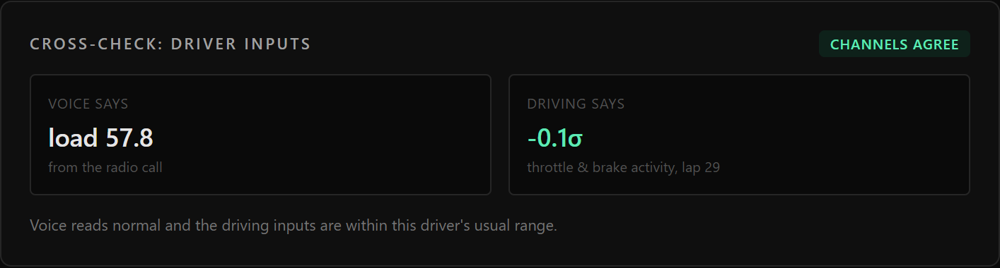

When they disagree, that is *reported*, not hidden. This is the informative case: the voice is
loaded but the driving is still clean.

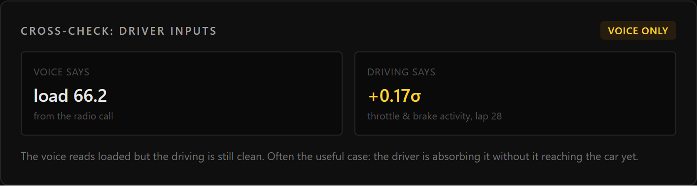

### 6. Cross-check against an off-the-shelf emotion classifier

The reference classifier stays on screen precisely so you can see it fail:

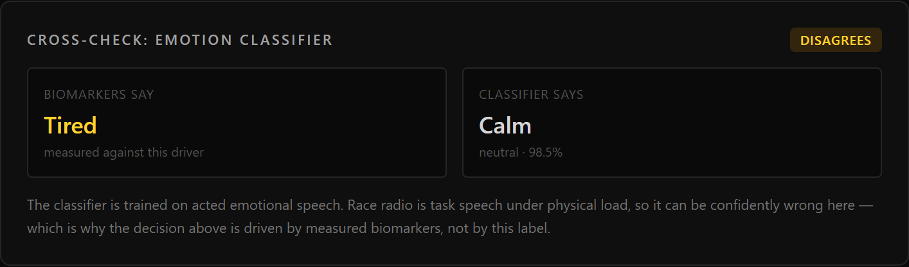

> *"The classifier is trained on acted emotional speech. Race radio is task speech under physical
> load, so it can be confidently wrong here — which is why the decision above is driven by measured
> biomarkers, not by this label."*

### 7. See the whole stint at a glance

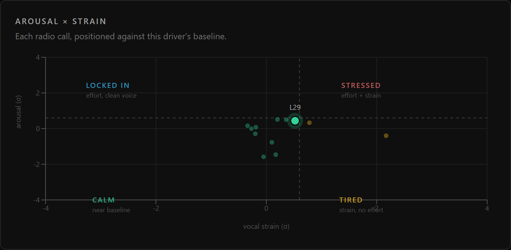

Every call plotted on the two axes. **Locked In** is the state a one-dimensional model cannot
express: a driver working hard *and* performing.

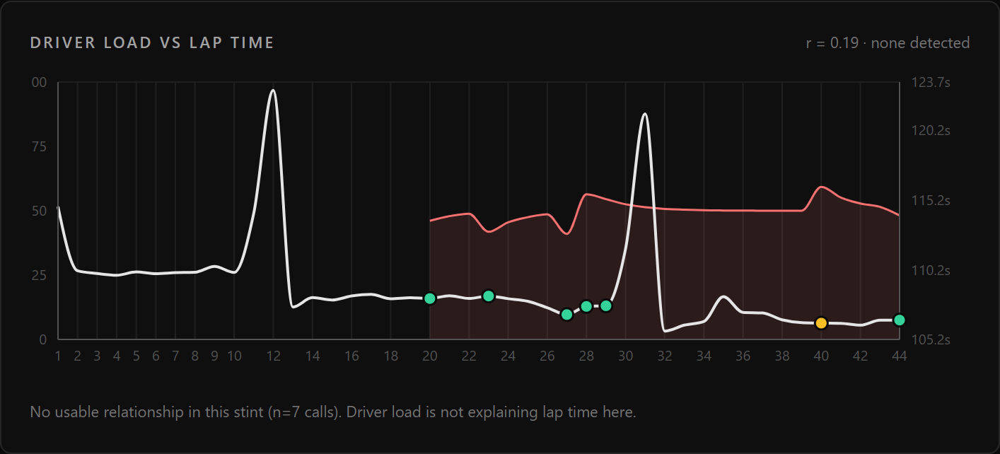

Driver load against real lap time. And when there is nothing to find, it says so: *"No usable
relationship in this stint (n=7 calls). Driver load is not explaining lap time here."*

### 8. Ask out loud, because the problem is that eyes are on the data

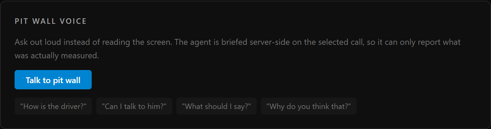

An **OmniDimension** agent answers *"How is the driver?"*, *"Can I talk to him?"*, *"What should I
say?"*, *"Why do you think that?"* — briefed server-side on the selected call, so it can only report
what was actually measured.

### 9. Know where every number came from

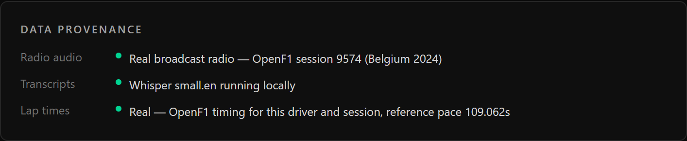

Real broadcast radio, real lap timing, and the ASR model named on screen. Nothing is simulated
without saying so.

---

## It refuses to answer when it shouldn't

This is the part most submissions skip, and the part a race engineer would check first.

**Bad audio is rejected, with the reason.**

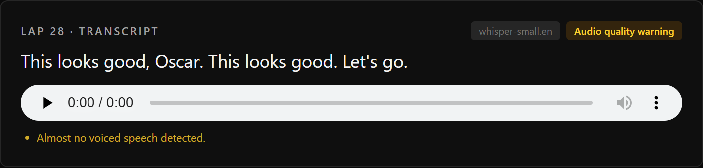

**An uncalibrated driver gets no state call at all.**

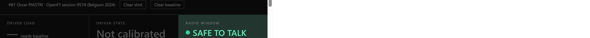

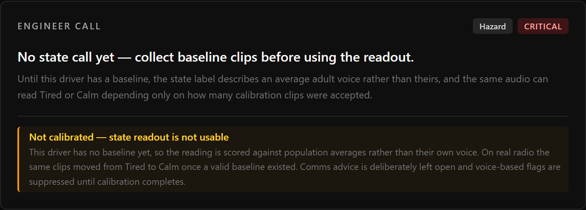

The load is withheld, the state reads **Not calibrated**, and the provisional label is shown only
with the caveat attached. Comms are deliberately left **open** — the next section explains why that
direction is the safe one.

---

## Where it was wrong, and how we found out

### The defect: a state label that was really a baseline artefact

Running four drivers through one race, Lewis Hamilton came out `Tired` on 6 of 6 calls while every
other driver produced a mix. He was also the only driver whose calibration failed — 2 of 4 clips
passed the quality gate, and `MIN_BASELINE_SAMPLES` is 3.

So we held the six clips fixed and varied only the baseline behind them (`ablate_baseline.py`):

| Baseline | Result |
|---|---|
| none (population priors) | `Tired` ×6, load 60–73, strain +1.1…+2.5 |
| 2 clips (as run) | **byte-identical to none** |
| 5 clips (valid) | `Calm` ×5 + `Locked In` ×1, load 50–54, strain ≈ +0.2 |

**6 of 6 states moved.** Those two accepted baseline clips did nothing at all.

Worse was the effect downstream: uncalibrated, the fake loads closed the radio window, raised a
*"Sustained load"* warning and recommended *"consider an earlier stop"* — while the same audio,
calibrated, said *"normal comms."*

**The fix.** The only power this tool has over an engineer is to *restrict* comms, so restricting on
a reading taken against population averages is the one failure that does harm. Uncalibrated now
degrades to open comms and states what is missing. Safety-critical traffic and first-hand reported
limits still override, since neither needs a baseline. 12 regression checks pin it.

### Measured, not guessed: population priors from real radio

The fallback priors were textbook figures for clean adult speech in a quiet room. We replaced them
with the median and MAD-derived spread over **435 quality-gated real F1 radio clips** from six 2024
races:

| feature | guessed | measured |
|---|---|---|
| jitterPct | 1.6 ± 0.90 | **3.83 ± 1.56** |
| shimmerPct | 9.0 ± 4.00 | **14.37 ± 2.88** |
| hnrDb | 8.0 ± 4.00 | **3.40 ± 1.33** |
| pauseRatio | 0.45 ± 0.15 | **0.616 ± 0.123** |

Every one of the four **strain** features was wrong in the direction that inflates strain on radio —
the mechanism behind the false `Tired` readings above. Re-running the same ablation, error against
the calibrated truth roughly halved:

```
mean |load   - calibrated|   15.6 -> 9.3
mean |strain - calibrated|   1.97 -> 1.04
```

---

## Does it actually predict anything? (an honest null result)

Every weight in `state.py` was chosen by reasoning. That is the fairest criticism of this project, so
we answered it with a label the driver never talks about: what their lap time does next.

`validate_at_scale.py` — 435 clips, 6 races, 408 scored across 102 driver-races. Features from audio,
label from timing hardware, paired only at analysis time.

```
load vs next-lap delta        pearson -0.071   spearman -0.081
held-out R² (unseen races)    -0.029
shuffled-label null           mean -0.022, 95th pct -0.000
p                             0.680
```

**No held-out signal.** Ridge regression on races it never saw does not beat predicting the mean.

*What this rules out:* any claim that the state score forecasts lap time.
*What it does not rule out:* that the score tracks driver state — lap time is dominated by fuel,
tyres, traffic and safety cars, and most clips still carry the engineer's voice as well.

The first version of that script scored **0 clips** and printed a confident "no signal" anyway. It
now refuses to print a verdict below 50 clips or 3 races, because a null from an empty set is worse
than no answer.

## Three things we tried and could not make work

The biggest known limitation is that a single transmission often contains **both the driver and the
engineer**. We attacked it three ways and failed three times, measured each time:

| Attempt | Method | Result |
|---|---|---|
| `services/speaker.py` | WavLM speaker verification across clips | separation **0.011** (same-driver 0.841 vs different 0.830) |
| `services/diarize.py` | Within-clip 2-cluster diarisation, speaker *and* channel features | **66%** window accuracy vs **50%** chance |
| `services/attribution.py` | Language-based, human transcripts, labelling cues stripped | balanced **48%** vs **50%** chance |

The diarisation control settles it: a clip joined to an *exact copy of itself* — no boundary at all —
still scored 0.45–0.61 separation and was called two speakers 6 times out of 6. The silhouette
measures loud speech against quiet speech, not how many people are talking.

All three modules are committed, **unwired**, with the numbers in their docstrings. Three independent
methods say this limitation is real and unsolved on audio already mixed to one broadcast channel.

---

## The problem behind the problem

The brief says engineers miss warning signs in a driver's voice because they are too busy watching
data. True — but that is only half of it. The other half is that when engineers *do* notice, the
instinctive response is to talk to the driver, and talking to a driver who is already at capacity is
how a bad lap becomes a lost race.

### Why the obvious build is not good enough

**1. Emotion classifiers are trained on acted speech.** RAVDESS, IEMOCAP and similar corpora are
actors performing emotions. Race radio is task speech under g-load, heat and dehydration. The model
does not know it is out of domain — it returns a confident label regardless. We kept it on screen to
show exactly that.

**2. An absolute label ignores the driver.** Some drivers are naturally loud and fast-talking.
Scoring them against a population average marks them permanently stressed.

**3. One axis cannot separate the states that matter.** A driver on a qualifying lap and a driver who
is drowning both sound "high arousal".

---

## How it works

### Eight explainable biomarkers

Computed with plain signal processing (`services/features.py`) — no model:

| Measure | What it indicates |
|---|---|
| F0 mean / variability | Pitch; rises with arousal |
| RMS energy | Vocal effort |
| Articulation rate | Words per second of speech, pauses excluded |
| High-frequency energy ratio | Vocal effort — voiced frames only, so background noise cannot fake it |
| Jitter | Cycle-to-cycle pitch instability |
| Shimmer | Cycle-to-cycle amplitude instability |
| Harmonics-to-noise ratio | Voice clarity; falls under strain |
| Pause ratio | Rises with fatigue |

Pitch tracking is FFT-based autocorrelation over 40 ms frames, verified against synthetic signals of
known F0 from 95–300 Hz.

### Scored against the driver's own baseline

Three calm clips calibrate the driver. Everything after is a robust z-score (median + MAD), clamped
to ±4σ so a tight baseline cannot manufacture absurd readings.

### Two axes, four states

```
                    high arousal
                         │
          LOCKED IN      │      STRESSED
      (effort, clean)    │   (effort + strain)
                         │
   low strain ───────────┼─────────── high strain
                         │
            CALM         │        TIRED
       (near baseline)   │   (strain, no effort)
                         │
                     low arousal
```

**Locked In** still closes the radio window — but for the opposite reason to Stressed.

### Tone × content, not tone alone

The transcript is classified into race-radio intents (zero-shot, `valhalla/distilbart-mnli-12-1`).
Hazard terms bypass the model entirely — safety detection is never left to a probabilistic
classifier.

| State | Intent | Call |
|---|---|---|
| Stressed | Car problem | Confirm you've seen it, give one number, nothing else |
| Stressed | Self-blame | Do not send data. One reassurance, then silence |
| Tired | Physical strain | Bring the pit window forward, simplify every call |
| Locked In | anything non-critical | Radio silence. The driver is delivering |
| Calm | Car problem | Good window to debrief properly |

**Tone/content mismatch:** a driver saying "I'm fine" with vocal strain well above baseline raises an
under-reporting flag. Drivers downplay problems; the voice does not.

### The radio window

`OPEN` / `CAUTION` / `CLOSED`, with a word budget of 26 / 12 / 6. Safety-critical traffic always
overrides a closed window.

### Cost in seconds

Driver load is correlated against lap-time delta at lags of 0, 1 and 2 laps, and the best lag is
reported — that lag is the warning time the pit wall actually gets. Correlations are suppressed below
five **measured** radio calls.

---

## Verification

Everything below is a command you can run.

```powershell
cd backend
.venv\Scripts\python.exe verify_features.py          # 37 known-answer + ablation checks
.venv\Scripts\python.exe verify_calibration_gate.py  # 12 checks on the uncalibrated gate
.venv\Scripts\python.exe stress_test.py              # 10 adversarial audio inputs
.venv\Scripts\python.exe verify_api.py               # every route reachable
.venv\Scripts\python.exe verify_voice.py             # end-to-end voice path
```

| Suite | Result |
|---|---|
| `verify_features.py` | **37/37** |
| `verify_calibration_gate.py` | **12/12** |
| `stress_test.py` | **10/10** adversarial inputs correctly refused |

The stress suite feeds it silence, a 0.3 s fragment, white noise, engine roar, music, clipped audio,
a near-silent whisper, DC offset and a single click. All are refused with a stated reason.

Measurement scripts (these produce the numbers quoted above):

```powershell
.venv\Scripts\python.exe ablate_baseline.py --driver 44   # the calibration defect
.venv\Scripts\python.exe evaluate_discrimination.py       # does it discriminate across drivers?
.venv\Scripts\python.exe validate_at_scale.py             # 6-race held-out validation
.venv\Scripts\python.exe verify_diarize.py                # the speaker-splitting failure
.venv\Scripts\python.exe verify_attribution.py            # the language-based failure
```

---

## Real data

### Source 1 — Hugging Face, for measuring our own accuracy

[`MikCil/f1-team-radio`](https://huggingface.co/datasets/MikCil/f1-team-radio) — CC BY 4.0, public,
not gated. One shard holds **2,937 clips across 26 drivers and 37 Grands Prix**, each with a human
`transcription`. That ground-truth column lets us **measure** speech recognition rather than assert
it.

**Whisper hallucinates on real radio, badly.** `whisper-base.en` scored **174.7% WER** — a five-word
clip (*"I'll shut the TV up."*) decoded as *"I'm sorry"* twenty-eight times. Blocking repeated
n-grams at decode time, adding a degenerate-output detector, and moving to `whisper-small.en` brought
it to **17.7% WER** over 249 reference words.

### Source 2 — OpenF1, for real lap timing

[OpenF1](https://openf1.org) publishes team radio **and** lap timing keyed to the same `session_key`,
so a message can be placed on the lap it was actually transmitted during.

```powershell
.venv\Scripts\python.exe load_openf1_stint.py --year 2024 --country Belgium
.venv\Scripts\python.exe run_stint.py sample_audio\openf1\9574_81
```

Real timing is messy. Japan 2024 lap 2 reads **1714 seconds** — that is the red flag, not a lap. Laps
more than 25% off the median are excluded from the reference pace but **kept in the series**, because
they happened. On Spa 2024 the derived reference pace is 109.062 s, a 1:49 lap.

### Other things running on real audio showed

**Absolute loudness is not a usable biomarker on broadcast audio.** Clips of the same driver differed
by **8.5 dB** purely from the TV mix. `energyDb` is still measured and displayed but is **excluded
from the arousal axis**.

**You cannot compare strain across clips of different quality — so we don't pretend to.** SNR across
clips of the *same driver* ranged from **8.2 dB to 60 dB**. Where a call's SNR differs from the
baseline by more than 6 dB, the reading is marked Low confidence with the reason on screen.

**The quality gate earns its place.** It rejected 2 of 6 calibration clips outright.

---

## Running it

### As one container (what a Hugging Face Space runs)

```powershell
docker build -t pitwall .
docker run -p 7860:7860 pitwall
```

The image builds the frontend, then serves it from the API — one process, one port.

### For development

**Voice agent (optional).** Copy `backend/.env.example` to `backend/.env` and add an OmniDimension
API key. `backend/.env` is gitignored — never commit a key. Without it everything still works; the
voice panel reports "not configured".

**Backend** (http://localhost:8000)

```powershell
cd backend
.venv\Scripts\python.exe -m uvicorn main:app --port 8000 --reload
```

**Frontend** (http://localhost:5173)

```powershell
cd frontend
npm run dev
```

First run downloads three Hugging Face models (~1.6 GB) into `~/.cache/huggingface`. Everything runs
locally on CPU after that.

---

## Hugging Face models

| Model | Role |
|---|---|
| `openai/whisper-small.en` | Speech to text (17.7% WER measured on real F1 radio) |
| `valhalla/distilbart-mnli-12-1` | Zero-shot radio intent classification |
| `superb/wav2vec2-base-superb-er` | Reference emotion classifier, kept as an on-screen cross-check |
| `microsoft/wavlm-base-plus-sv` | Speaker separation attempts — measured, rejected, unwired |

| Dataset / API | Role |
|---|---|
| `MikCil/f1-team-radio` | Real broadcast radio + human transcriptions for ASR scoring (CC BY 4.0) |
| OpenF1 | Real team radio, lap timing and car telemetry by session |

`PITWALL_ASR_MODEL` overrides the ASR model without a code change.

---

## Honest limitations

- The state labels have **never been validated against real driver stress**, because no labelled
  public dataset of F1 driver stress exists. Quadrant thresholds, feature weights and the decision
  table are chosen by reasoning, not learned.
- The score **does not predict lap time** on held-out races (p = 0.68, above).
- Clips containing both driver and engineer are scored as one voice. Three independent attempts to
  fix this failed, and the numbers are in the table above.
- Correlations from a single stint are indicative, not evidence. The interface says so.
- The reference emotion classifier is shown for contrast, not treated as ground truth.
- The system advises. The engineer decides.

---

## Layout

```
backend/
  main.py                       FastAPI routes
  services/
    features.py                 biomarker extraction + signal-quality gate
    state.py                    baseline, z-scores, arousal/strain quadrant
    content.py                  zero-shot radio intent + hazard override
    advisor.py                  radio window, engineer action, message compression
    analytics.py                load-vs-lap-time correlation and cost
    driving.py                  OpenF1 car telemetry cross-check
    transcribe.py               Whisper
    reference_model.py          the cross-check emotion classifier
    omnidim.py / briefing.py    OmniDimension agent + the briefing it receives
    speaker.py                  MEASURED, NOT USED - cross-clip speaker id
    diarize.py                  MEASURED, NOT USED - within-clip diarisation
    attribution.py              MEASURED, NOT USED - language-based attribution
  verify_features.py            37-check verification harness
  verify_calibration_gate.py    12 checks on the uncalibrated gate
  stress_test.py                10 adversarial audio inputs
  ablate_baseline.py            the baseline-artefact ablation
  validate_at_scale.py          6-race held-out validation + permutation null
  evaluate_discrimination.py    cross-driver discrimination
  load_real_radio.py            pull real F1 radio from Hugging Face
  load_openf1_stint.py          pull real radio + lap timing from OpenF1
  run_stint.py                  analyse a folder of clips, score ASR against ground truth
frontend/src/
  App.tsx                       layout and session state
  components/                   status strip, quadrant, charts, advisor, console, voice, provenance, log
docs/screenshots/               the images in this README
```
